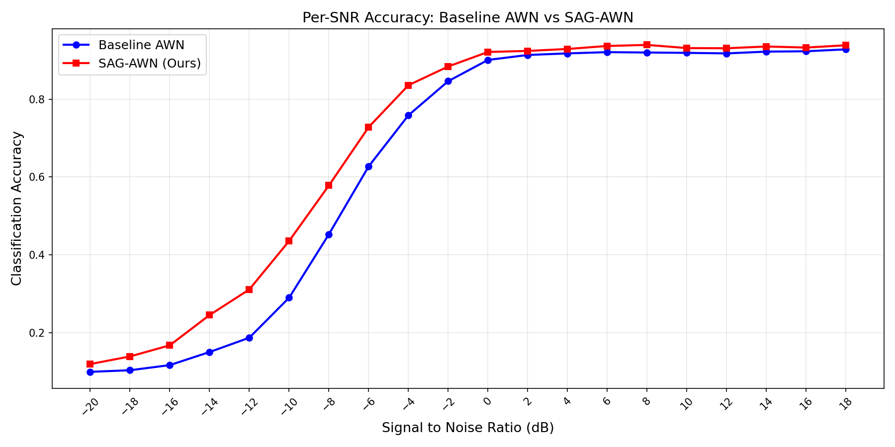
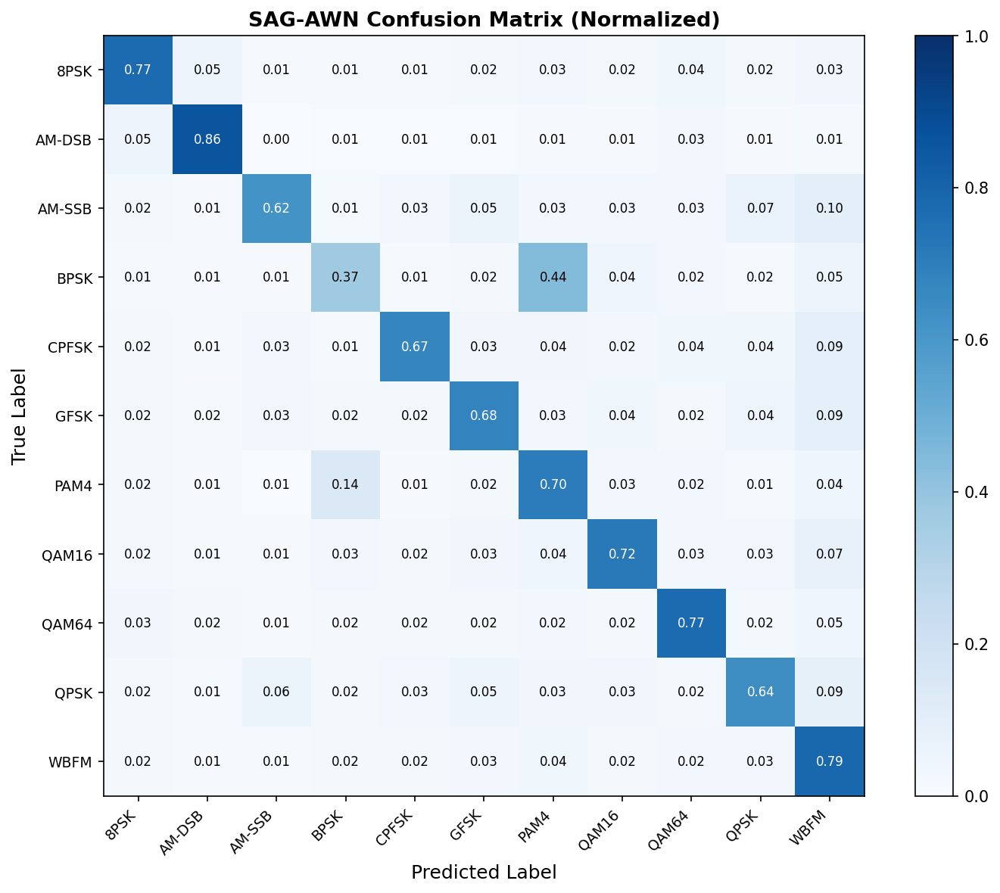
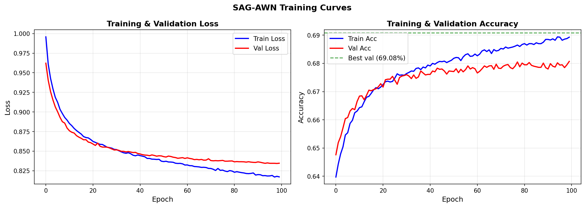

# SNR-Adaptive Gating for Automatic Modulation Classification

This project extends the Adaptive Wavelet Network (AWN) architecture for Automatic Modulation Classification (AMC) by introducing a lightweight SNR-Adaptive Gating (SAG) module.

The proposed method dynamically reweights wavelet-domain features according to receiver-estimated Signal-to-Noise Ratio (SNR) information.

---

## Project Overview

Automatic Modulation Classification (AMC) is an important problem in wireless communication systems, cognitive radio, and spectrum monitoring applications.

The original AWN architecture applies identical feature processing regardless of channel quality. In this project, we introduce an SNR-aware gating mechanism that adaptively modifies wavelet feature importance according to the estimated channel SNR.

---

## Original Paper

J. Zhang et al.

"Towards the Automatic Modulation Classification with Adaptive Wavelet Network"

IEEE Transactions on Cognitive Communications and Networking (TCCN), 2023.

---

## Baseline Repository

Original AWN GitHub repository:

https://github.com/zjwfufu/AWN

---

## Our Contributions

Compared to the original AWN implementation, we introduced the following improvements:

- Reproduced the original AWN baseline
- Added SNR-Adaptive Gating (SAG)
- Added residual feature-wise gating
- Used normalized receiver-estimated SNR as auxiliary input
- Applied differential learning rates for stable fine-tuning
- Performed ablation studies
- Generated per-SNR evaluation visualizations
- Improved overall accuracy from 64.24% to 69.00%

---

## Our Modifications vs Baseline

| Component | Original AWN | SAG-AWN |
|---|---|---|
| Input | I/Q samples | I/Q samples + SNR |
| Feature extraction | Adaptive wavelet features | Adaptive wavelet features |
| SNR usage | Not used | Used for feature gating |
| Added module | None | Two-layer SAG MLP |
| Training | Baseline AWN training | Differential learning rates |
| Evaluation | Overall accuracy | Overall accuracy, per-SNR analysis, ablation study |

---

## Results

| Model | Accuracy |
|---|---:|
| AWN Baseline | 64.24% |
| SAG-AWN (Ours) | 69.00% |

---

## Per-SNR Performance Comparison



The largest improvements are observed in the low-to-mid SNR transition region between -12 dB and -6 dB.

---

## Confusion Matrix



---

## Training Curves



---

## Ablation Study

| Configuration | Accuracy |
|---|---:|
| AWN Baseline | 64.24% |
| SAG-AWN (constant zero-SNR) | 26.05% |
| SAG-AWN (noisy SNR ±5%) | 67.46% |
| SAG-AWN (oracle SNR) | 69.00% |

The severe performance degradation under constant zero-SNR input confirms that the model genuinely learns meaningful SNR-aware feature weighting.

---

## Dataset

Dataset used in this project:

RadioML2016.10a

Dataset download:

https://www.deepsig.ai/datasets

The dataset is not included in this repository due to file size limitations. After downloading, place the dataset file inside the `data/` directory.

---

## Installation

```bash
pip install -r requirements.txt
```

---

## Running the Project

Open `MYZ307E_AWN_SAG_Final.ipynb` in Google Colab and run the cells sequentially.

Main stages:

1. Install requirements
2. Load RadioML2016.10a dataset
3. Reproduce AWN baseline
4. Train/evaluate SAG-AWN
5. Generate visualizations and ablation results

---

## Repository Structure

```text
visuals/        -> evaluation figures
report/         -> final report
checkpoints/    -> trained model weights
data/           -> dataset instructions
```

---

## Team Members

- Eren Dervişoğlu
- Egemen Durmaz
- İlker Doğan

---

## Course Information

MYZ307E - Machine Learning for Electrical and Electronics Engineering

Spring 2025-2026
